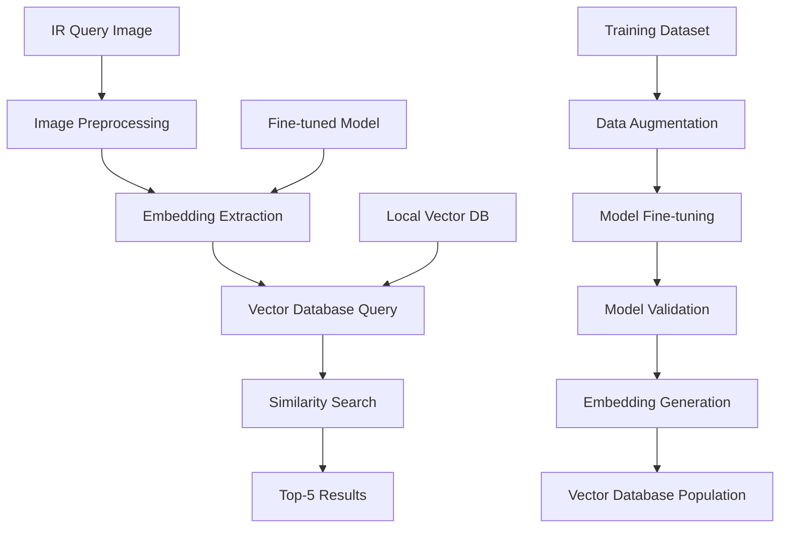

# IR Image Classification System Design

## Overview

The IR Image Classification System is a high-precision, locally-deployed solution for military object identification using deep learning embeddings. The system processes infrared imagery through fine-tuned neural networks, stores embeddings in a local vector database, and performs fast similarity searches to identify objects with military-grade accuracy and security.

## Architecture

The system follows a modular architecture with clear separation of concerns:



### Core Components:

1. **Data Pipeline**: Handles dataset creation, augmentation, and preprocessing
2. **Model Training**: Fine-tunes pre-trained models on IR military imagery
3. **Embedding Service**: Extracts embeddings from query images
4. **Vector Database**: Stores and indexes embeddings for fast retrieval
5. **Query Engine**: Performs similarity search and ranking
6. **API Layer**: Provides interfaces for system interaction

## Components and Interfaces

### 1. Data Pipeline Component

**Purpose**: Transform raw IR images into training-ready datasets

**Key Classes**:

- `IRImageProcessor`: Handles IR-specific preprocessing (contrast enhancement, noise reduction)
- `DataAugmentationEngine`: Applies military-relevant augmentations
- `DatasetManager`: Organizes and validates dataset integrity

**Interfaces**:

```python
class IDataAugmentation:
    def augment_batch(self, images: List[np.ndarray], target_count: int) -> List[np.ndarray]
    def preserve_ir_characteristics(self, image: np.ndarray) -> np.ndarray

class IImageProcessor:
    def preprocess_ir_image(self, image: np.ndarray) -> np.ndarray
    def validate_ir_format(self, image: np.ndarray) -> bool
```

**Augmentation Strategies**:

- Rotation (±15 degrees to maintain object orientation)
- Scale variations (0.8x to 1.2x)
- Gaussian noise addition (simulating sensor noise)
- Brightness/contrast adjustments (IR-specific)
- Horizontal flipping (where militarily appropriate)
- Elastic deformations (subtle, preserving object integrity)

### 2. Model Training Component

**Purpose**: Fine-tune pre-trained models for IR military object classification

**Key Classes**:

- `ModelTrainer`: Orchestrates training process
- `IRModelAdapter`: Adapts ResNet50/Qwen for IR imagery
- `TrainingMetrics`: Tracks precision, recall, and embedding quality

**Model Options**:

**Option A: ResNet50-based Approach**

- Use ResNet50 pre-trained on ImageNet
- Replace final classification layer with embedding layer (512-dim)
- Add IR-specific preprocessing layers
- Fine-tune with triplet loss for embedding optimization

**Option B: Qwen-VLM Approach**

- Leverage Qwen's vision encoder
- Fine-tune vision component on IR imagery
- Extract visual embeddings (ignoring text components)
- Optimize for IR-specific features

**Training Strategy**:

- Contrastive learning with triplet loss
- Hard negative mining for challenging examples
- Progressive unfreezing of model layers
- Validation on held-out military test set

### 3. Embedding Service Component

**Purpose**: Extract high-quality embeddings from IR images

**Key Classes**:

- `EmbeddingExtractor`: Main interface for embedding generation
- `ModelInference`: Handles model loading and inference
- `EmbeddingValidator`: Ensures embedding quality

**Interface**:

```python
class IEmbeddingExtractor:
    def extract_embedding(self, image: np.ndarray) -> np.ndarray
    def batch_extract(self, images: List[np.ndarray]) -> List[np.ndarray]
    def validate_embedding_quality(self, embedding: np.ndarray) -> float
```

### 4. Vector Database Component

**Purpose**: Store, index, and query embeddings efficiently

**Database Options**:

- **Primary Choice**: Chroma (local, lightweight, good for military deployment)
- **Alternative**: Faiss (Facebook's similarity search, highly optimized)
- **Backup**: Qdrant (local deployment, good performance)

**Key Classes**:

- `VectorStore`: Main database interface
- `IndexManager`: Handles index creation and optimization
- `SimilaritySearcher`: Performs k-NN searches

**Index Strategy**:

- HNSW (Hierarchical Navigable Small World) for fast approximate search
- IVF (Inverted File) for exact search when needed
- Cosine similarity as primary distance metric
- Euclidean distance as secondary option

### 5. Query Engine Component

**Purpose**: Process queries and return ranked results

**Key Classes**:

- `QueryProcessor`: Handles incoming query requests
- `ResultRanker`: Ranks and filters similarity results
- `ConfidenceCalculator`: Computes confidence scores

**Query Flow**:

1. Preprocess query image
2. Extract embedding
3. Perform vector similarity search
4. Calculate confidence scores
5. Filter and rank top-5 results
6. Return results with metadata

## Data Models

### Core Data Structures

```python
@dataclass
class IRImage:
    id: str
    image_data: np.ndarray
    metadata: Dict[str, Any]
    object_class: str
    confidence_score: float
    created_at: datetime

@dataclass
class Embedding:
    id: str
    vector: np.ndarray
    image_id: str
    model_version: str
    extraction_timestamp: datetime

@dataclass
class SimilarityResult:
    image_id: str
    similarity_score: float
    confidence: float
    object_class: str
    metadata: Dict[str, Any]

@dataclass
class QueryResult:
    query_id: str
    results: List[SimilarityResult]
    processing_time: float
    model_version: str
    timestamp: datetime
```

### Database Schema

**Images Table**:

- id (PRIMARY KEY)
- file_path
- object_class
- metadata (JSON)
- created_at
- updated_at

**Embeddings Table**:

- id (PRIMARY KEY)
- image_id (FOREIGN KEY)
- embedding_vector (BLOB)
- model_version
- extraction_date

**Query_Log Table**:

- query_id (PRIMARY KEY)
- user_id
- results (JSON)
- processing_time
- timestamp

## Error Handling

### Error Categories and Responses

1. **Image Processing Errors**:

   - Invalid image format → Return structured error with format requirements
   - Corrupted image data → Log error, request re-upload
   - IR format validation failure → Provide specific IR format guidance

2. **Model Inference Errors**:

   - Model loading failure → Fallback to backup model, alert administrators
   - Out of memory errors → Implement batch processing with smaller chunks
   - CUDA/GPU errors → Fallback to CPU inference with performance warning

3. **Database Errors**:
   - Connection failures → Implement retry logic with exponential backoff
   - Index corruption → Rebuild index from stored embeddings
   - Query timeout → Return partial results with timeout warning

### Error Recovery Strategies

- **Graceful Degradation**: System continues operating with reduced functionality
- **Automatic Retry**: Transient errors retry with exponential backoff
- **Fallback Mechanisms**: Backup models and databases for critical failures
- **Comprehensive Logging**: All errors logged for forensic analysis

## Testing Strategy

### Unit Testing

- **Data Pipeline**: Test augmentation algorithms, preprocessing functions
- **Model Components**: Test embedding extraction, model loading
- **Vector Database**: Test CRUD operations, similarity search accuracy

### Integration Testing

- **End-to-End Pipeline**: Test complete flow from image upload to results
- **Performance Testing**: Measure query latency under various loads
- **Model Accuracy**: Validate precision/recall on military test datasets

### Performance Benchmarks

- **Query Latency**: < 2 seconds for single image queries
- **Throughput**: Handle at leat 1 query per 3 seconds
- **Accuracy**: 95%+ precision on top-5 results
- **Memory Usage**: Optimize for deployment on military hardware

### Military-Specific Testing

- **Adversarial Testing**: Test against adversarial examples
- **Robustness Testing**: Various IR sensor conditions and noise levels
- **Security Compliance**: Meet military security standards
- **Offline Operation**: Verify complete offline functionality

### Test Data Strategy

- **Training Set**: 70% of augmented dataset (10.5k-12.6k images)
- **Validation Set**: 15% of augmented dataset (2.25k-2.7k images)
- **Test Set**: 15% of augmented dataset (2.25k-2.7k images)
- **Hold-out Military Set**: Separate classified dataset for final validation
