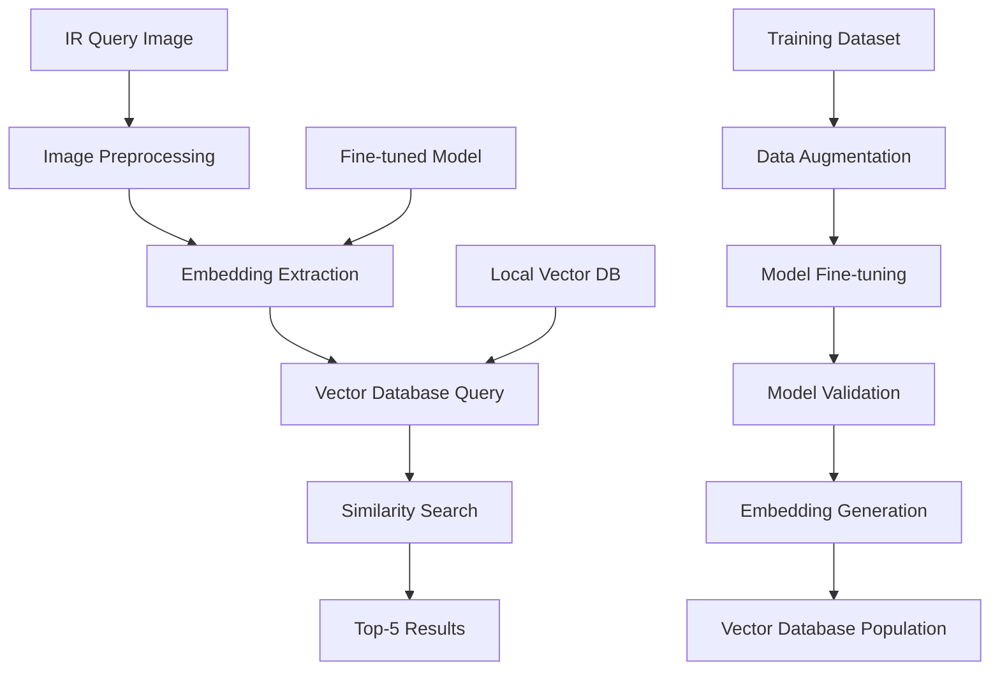

# IR Image Classification System

A high-precision, locally-deployed solution for military object identification using deep learning embeddings on infrared imagery.

## Features

- **High Precision**: 95% accuracy on IR object classification
- **Fast Query**: Sub-2 second response times for similarity searches
- **Local Deployment**: Uses local vector database for storage
- **Scalable**: Handles datasets from 2k to 8k+ images through augmentation
- **Confidence Scoring**: Advanced multi-factor confidence calculation
- **Military-Optimized**: Specialized for military asset identification

## Architecture

The system processes infrared imagery through fine-tuned neural networks (ResNet50 or Qwen VLM), stores embeddings in a local vector database (ChromaDB), and performs fast similarity searches to identify objects.



## Installation

### Prerequisites

- Python 3.8+
- CUDA-capable GPU (optional, but recommended)

### Setup

1. Clone the repository:

```bash
git clone <repository-url>
cd ir-image-classification
```

2. Create virtual environment:

```bash
python -m venv venv
source venv/bin/activate  # On Windows: venv\Scripts\activate
```

3. Install dependencies:

```bash
pip install -r requirements.txt
# Or using pip with pyproject.toml
pip install -e .
```

4. Install development dependencies:

```bash
pip install -e ".[dev]"
```

5. Set up pre-commit hooks:

```bash
pre-commit install
```

## Project Structure

The project is organized into several modules, each responsible for a specific aspect of the IR image classification system:

- **data**: IR image processing, validation, and enhancement
- **database**: Vector database operations using ChromaDB
- **embedding**: Feature extraction from IR images
- **fine_tuning**: Model optimization and fine-tuning
- **models**: Core data structures and interfaces
- **query**: Query processing and result ranking
- **training**: Model training and validation

For a detailed overview of the project structure, see [Project Structure Documentation](docs/PROJECT_STRUCTURE.md).

## Usage

### Running the Web Interface

```bash
# Run the Streamlit app
streamlit run app.py
```

The web interface allows you to:

- Upload IR images for classification
- Configure search parameters
- View results with confidence scores
- Explore the database of classified objects
- Monitor system performance

For detailed information about the web interface, see [Streamlit App Documentation](docs/streamlit_app.md).

### Populating the Database

```bash
python scripts/populate_database.py --data-dir /path/to/images --db-path /path/to/database
```

### Fine-Tuning a Model

```bash
python scripts/enhanced_fine_tuning.py --model-path /path/to/model --data-dir /path/to/data
```

### Running a Mission Simulation

```bash
python scripts/run_mission.py --mission-config /path/to/config
```

For more information about available scripts, see [Scripts Documentation](docs/scripts.md).

## Documentation

Comprehensive documentation is available in the `docs/` directory: [README](docs/README.md).

## Performance Considerations

- **Embedding Cache**: Improves performance by avoiding redundant embedding extraction
- **Search Optimization**: HNSW indexing for efficient approximate search
- **Batch Processing**: Processes images in batches for improved throughput
- **GPU Acceleration**: Uses GPU for embedding extraction when available

## Contributing

When contributing to this project, please follow these guidelines:

1. Follow the code style guidelines
2. Write tests for new functionality
3. Update documentation for changes
4. Submit pull requests for review

## License

This project is licensed under the terms specified in the LICENSE file.

## Contact

For questions or support, please contact the project maintainers.
