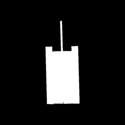

# Results Directory

This directory stores output results and reports from the IR Image Classification System.

## Examples of output

### Tank 1



The results have been obtained with the following comand:

```bash
python scripts/run_mission.py --database data/vector_db  --format json --disable-cache --model checkpoints/fine_tuning/contrastive_best_epoch_11.pth --image examples/tank_1.png -o results/tank_1_query_results.json --quiet
```

### Jeep 1


The results have been obtained with the following comand:

```bash
python scripts/run_mission.py --database data/vector_db  --format json --disable-cache --model checkpoints/fine_tuning/contrastive_best_epoch_11.pth --image examples/jeep_1.png -o results/jeep_1_query_results.json --quiet
```
